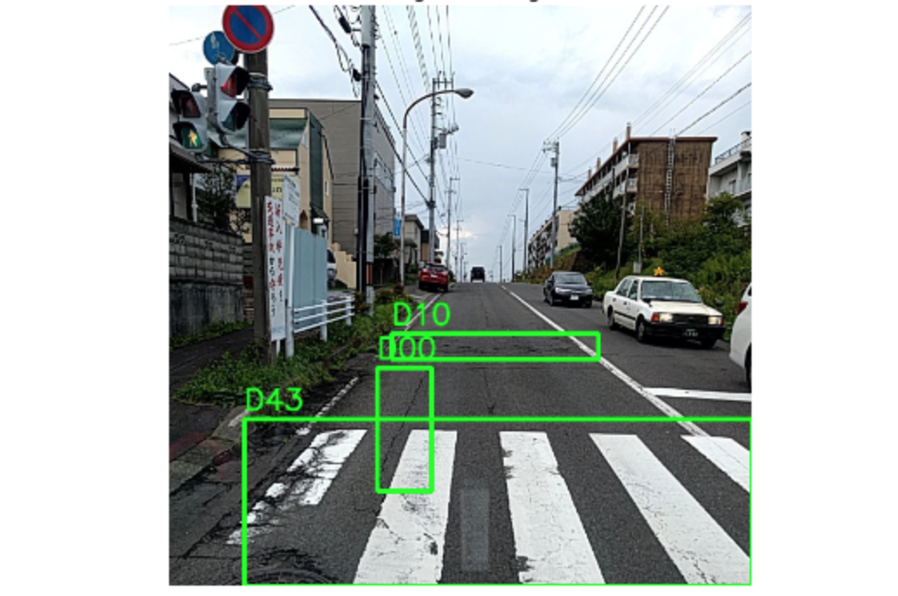

# yolov3-road-damage-detection

this repository contains the whole pipeline to train (tiny) yolov3 and deploy it

- `train` contains scripts to train the model
- `deploy-as-tflite` contains scripts to convert the model to .tflite
- `deploy-on-pi-with-nnpack` contains scripts to install nnpack on a raspberry pi and deploy the yolov3 model on it
- `deploy-on-pi-with-openvino` contains scripts to install openvino on a raspberry pi and deploy the yolov3 model on it
